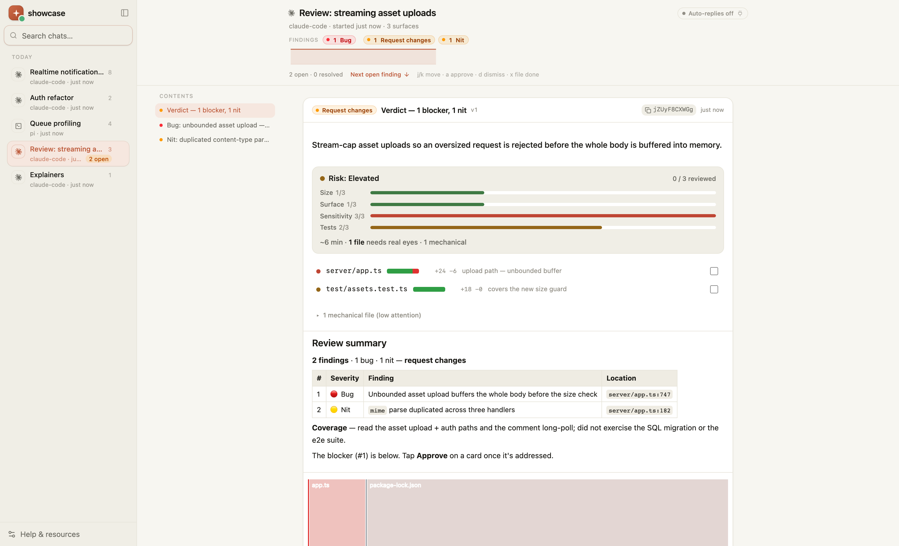
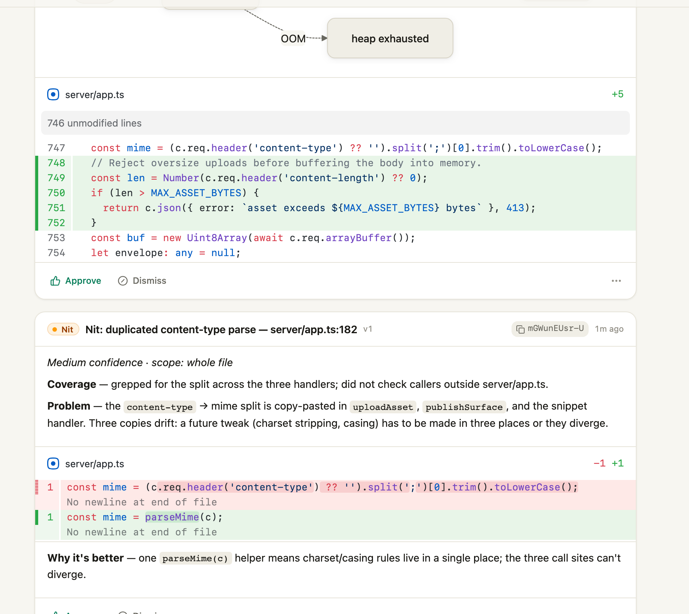
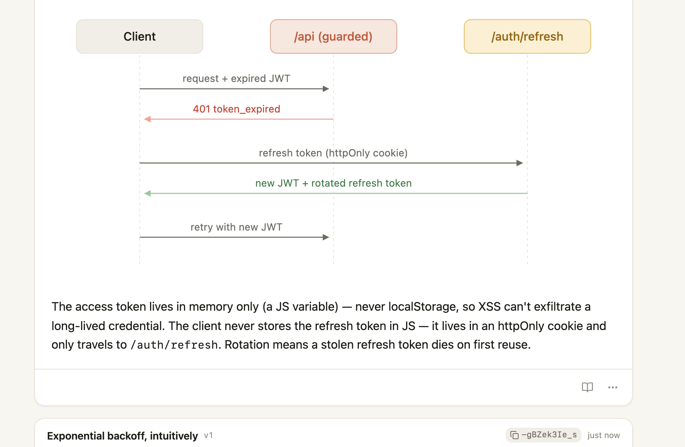
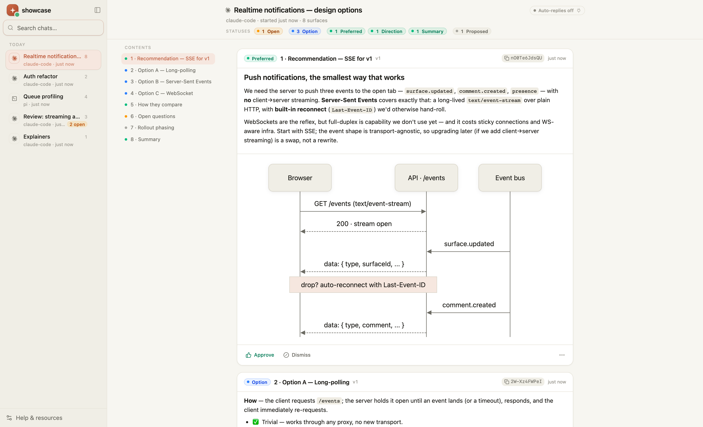
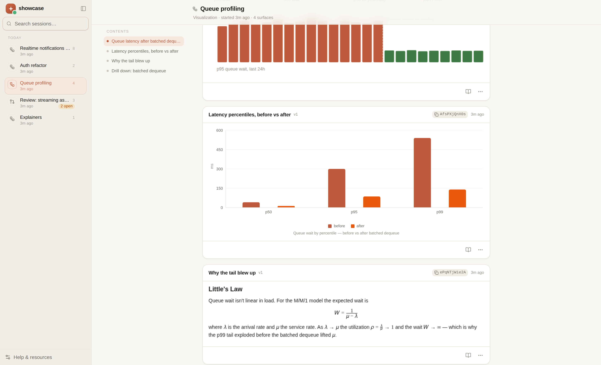
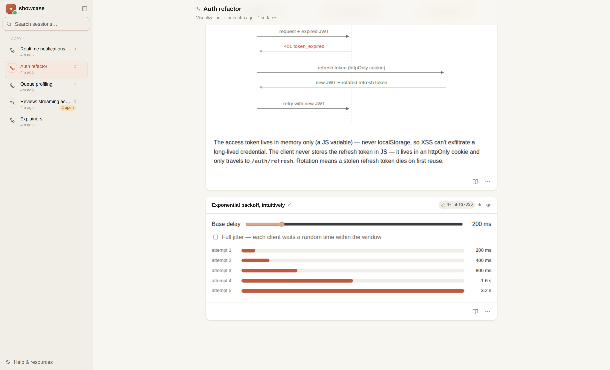
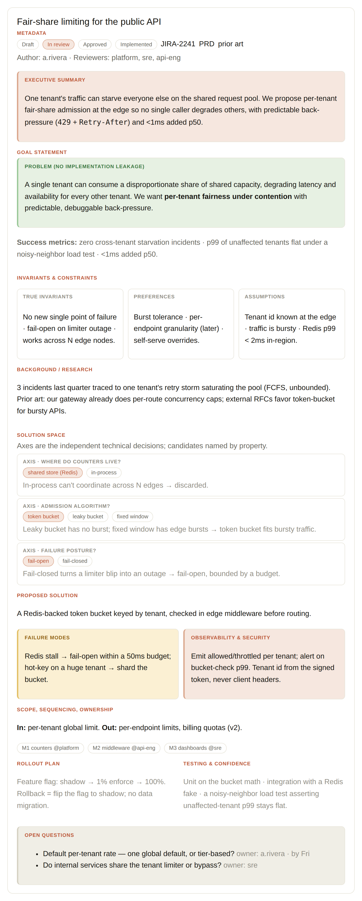
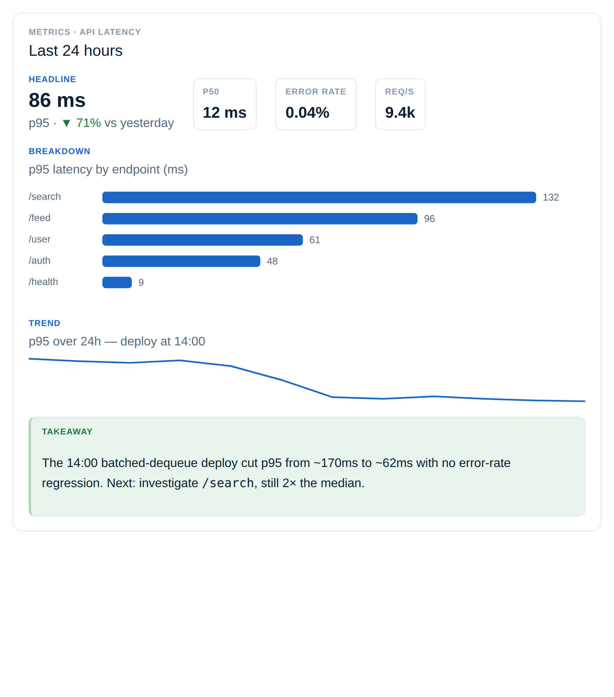
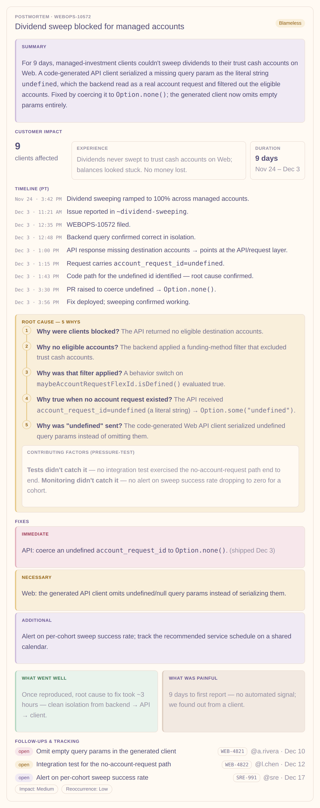
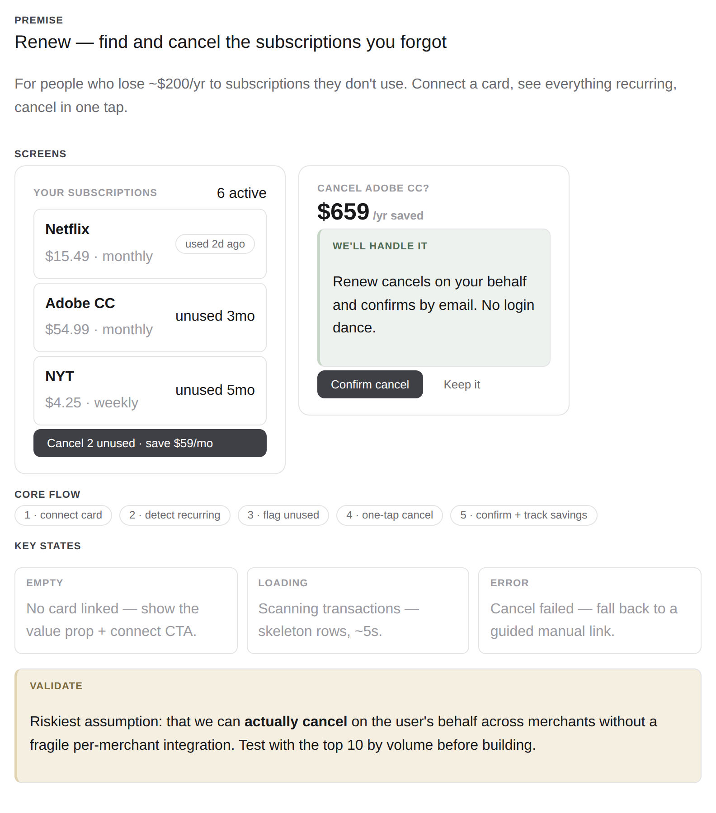

# showcase

**A visual surface for terminal coding agents — built for the two moments an
LLM's output is hardest to trust: reviewing the code it wrote, and understanding
what it's explaining.**

An agent produces a diff, or a dense explanation, faster than you can vet it in a
terminal scrollback — and the hard part isn't generating the output, it's
_understanding_ it well enough to trust it. showcase gives the agent a **screen**.
Its output arrives as live, reviewable **cards** — a syntax-highlighted diff, a
diagram, prose, a chart — that render in your browser as it works. You read,
comment on a card, or pin a note to an exact spot, and that feedback flows
straight back to the agent. The loop — **publish → live render → comment →
revise** — is the whole point. No GitHub thread or terminal scrollback does this.



A self-contained local-only engine: a Hono server, a React viewer, an MCP
server, and a zero-dependency CLI. It runs entirely on your machine.

> **See it in 30 seconds:** `pnpm install && pnpm build:viewer && pnpm serve`,
> then `node packages/cli/bin/showcase.js demo` and open <http://localhost:8229>.
> Every screenshot in this README is a real `showcase demo` session.

---

## What it's for

Two flagship workflows for making an agent's output legible — plus a third for
deciding before you build.

### 🔍 Review the code it wrote

_"The future of code review is multimodal."_ When an agent (or a human) hands you
a branch, the agent reviews it and publishes a **decision review** — a
plain-English **brief** (no code identifiers), a **verdict** (block / approve /
comment), and a **risk-ranked queue of decisions** the agent triaged out of the
diff for you to adjudicate. Backing the queue is a **manifest** of every changed
file, each tagged as carrying a decision, reviewed-no-comment, or
mechanical-skipped — so nothing the agent touched is silently dropped. You read
top-down and **Accept** (A) each decision; to push back you copy a decision's ref
and paste it into normal agent chat to scope a revision, and re-publishing updates
the decision in place. Far faster than scrolling a wall of inline comments to
decide whether the change is safe.

Each decision reads the same way no matter the PR — an **assertion** at a `scope`
(changed-line / whole-file / codebase), a `call` (block / ship / decide), a
**confidence** (high / medium / low — the one surfaced honesty signal), and, when
there's a fix, a before → after **proposal** rendered as a diff. So big and small
reviews stay scannable.



**showcase doesn't review — it renders.** The analysis is delegated to the
agent's own **`code-review` skill** (a generic, showcase-agnostic reviewer);
showcase only formats the decisions into the review queue. The dependency is
one-way — showcase knows about `code-review`, `code-review` knows nothing about
showcase — so the reviewer stays reusable outside showcase, and showcase stays
usable with any reviewer.

A session that carries a stored review is treated as a review session: it chips
its verdict in the sidebar and opens the queue inline. See
[`docs/review-form-factor.md`](docs/review-form-factor.md) for the full form
factor.

### 📚 Understand what it's explaining

When an agent traces an auth flow, maps an architecture, or explains a gnarly
algorithm, the answer is usually a dense paragraph you have to decode. Ask it to
draw instead, and you _see_ the thing — a labeled diagram, prose, rendered math
(KaTeX), and the real source, side by side — so a hard idea lands in a glance
instead of a re-read. Ideal for onboarding to an unfamiliar codebase, vetting an
unfamiliar dependency, or making sense of your own large branch before it ships.



### 🧭 Weigh a decision before you build

Hand the agent a design doc — or a fuzzy _"how should we build X?"_ — and it lays
the options out as cards, one per approach, each **status-badged** and rolled up
at the top so the shape of the decision reads at a glance: what's `Preferred`,
what's still an `Option`, what's an `Open` question. A live **table of contents**
tracks where you are as the thread grows past a screen. Comment on any card to
push back, or **Approve** to lock the direction — and the agent revises in place.



**Plus the everyday uses:** visualize data (native charts), render math (KaTeX),
sketch UI ideas (sandboxed HTML), or compose a walk-through deck with the
`slides` kit.





---

## Session presets — one format, every answer

The three workflows above all rely on the same idea, made explicit: a **session
preset**. Pin a preset to a session once and **every surface it publishes comes
out in the same structure and the same look — no matter what you ask.** A
"design-doc session" keeps producing design docs; a "data-viz session" keeps
producing dashboards. The repeatability _is_ the feature: you configure the
format, then think about the content.

A preset (internally a **blueprint**, see `packages/core/blueprints.ts`) bundles three
layers under one id:

- a **theme** — the palette (one of the built-ins, or your brand);
- a **kit** composition — the component vocabulary (`mockup`, `issues`, `animate`, …);
- a **structure** — the named, ordered sections the agent authors against.

### Built-in presets

| preset           | for                           | structure                                                                                                                                                  |
| ---------------- | ----------------------------- | ---------------------------------------------------------------------------------------------------------------------------------------------------------- |
| `design-doc`     | technical design / RFC        | metadata → summary → **goal (as a problem)** → invariants → background → **solution space (axes)** → proposed → scope → rollout → testing → open questions |
| `architecture`   | system design                 | overview → components → data flow → decisions → scale                                                                                                      |
| `data-viz`       | metrics dashboard             | headline → breakdown → trend → detail → takeaway                                                                                                           |
| `postmortem`     | blameless incident review     | summary → customer impact → timeline → **root cause (5 Whys)** → fixes (immediate/necessary/additional) → what went well/painful → owned follow-ups        |
| `status`         | recurring status report       | headline → shipped → in flight → blockers → next                                                                                                           |
| `product-demo`   | branded feature walkthrough   | hook → problem → feature → proof → cta                                                                                                                     |
| `product-mockup` | visualize a product idea fast | premise → screens → core flow → key states → validate                                                                                                      |
| `concept`        | teach-an-idea explainer       | question → mechanism → payoff                                                                                                                              |

Each renders consistently in light and dark (gallery: `docs/images/presets/`):









### Using a preset

It's MCP-driven — no UI to click. Either tell the agent up front (_"make this a
design-doc session"_) and it calls **`configure_session`**, or it passes
`blueprint` on its first publish; either way the preset **pins to the session**
and every later surface inherits it. Discover what's available with `showcase
blueprints` (or `GET /api/blueprints`).

**Tailored typed tools.** Six presets go further than a structure hint: they have
a dedicated MCP tool whose **server-side renderer owns the layout**, so the agent
fills typed slots and the output is byte-for-byte consistent every time — the same
guarantee `publish_decisions` gives a code review. `publish_postmortem` takes
`timeline[]` / `fiveWhys[]` / `fixes{immediate,necessary,additional}` /
`followups[]`; `publish_dashboard` takes `headline` / `stats[]` / `bars` /
`trend` and emits **native `chart` parts** (Recharts — real axes, interactive,
themed to the surface), not a static image; `publish_design_doc` takes
`goal{problem}` / `solutionSpace{axes[]}` / … ; plus `publish_status`,
`publish_architecture`, `publish_product_demo`. Every screenshot above is rendered
by these tools (`packages/server/presetRenders.ts`), not hand-authored. The generic
`publish_surface` + `blueprint` path remains for free-form surfaces.

### Defaults and your own presets — repo + user

Presets layer over the built-ins from two config dirs (more-specific wins by id):

```
<repo>/.showcase/   committed with the project — the team's shared format
~/.showcase/        personal — your own presets        (override: $SHOWCASE_CONFIG)
  blueprints/ *.json   a preset: { id, label, summary, theme, kits, structure[], extends? }
  themes/     *.json   a brand palette (light + dark)
  kits/       *.json   custom CSS/JS component vocabulary
  config.json          { "defaultBlueprint": "design-doc", "defaultTheme": "ocean" }
```

`config.json` sets the **default preset new sessions start in** — so a repo can
make _every_ session a design-doc session (the repo default wins over the user
default; the agent can still override per session). It's all JSON, no rebuild.

### Match your brand (theme building)

A theme is the palette layer. Hand-authoring one is 21 colors × light + dark; the
**derivation engine** (`packages/core/themeDerive.ts`) instead expands a few **seed**
colors into a full, contrast-checked light+dark palette. The intended loop: an
agent reads a screenshot you drop, names the brand color(s), and authors the
theme for you —

```sh
POST /api/themes  { "seed": { "id": "acme", "label": "Acme", "accent": "#5c46e6" }, "persist": true }
```

`persist:true` writes it to `~/.showcase/themes/` so it survives a restart. Point
a preset's `theme` at it to brand the whole format. See
[docs/theme-building.md](docs/theme-building.md) and the `session-presets` skill.

---

## Quickstart

**Requirements:** Node ≥ 22.18 (the server and CLI run TypeScript directly via
native type-stripping — no build step).

```sh
pnpm install
pnpm build:viewer        # builds packages/viewer/dist/index.html (once, and after viewer edits)
pnpm serve               # API + viewer on http://localhost:8229
```

1. Open **http://localhost:8229**.
2. Seed the example sessions above to explore: `node packages/cli/bin/showcase.js demo`.
3. List the CLI: `node packages/cli/bin/showcase.js --help`.

> Tip: install the CLI globally (`pnpm --filter @showcase/cli link --global`) so
> `showcase` is on your PATH; the examples below assume that. Otherwise use
> `node packages/cli/bin/showcase.js …`.

---

## Keep it running (no babysat tab)

`pnpm serve` ties the server to a terminal. You don't have to keep that tab
open — there are two lighter options.

**Auto-start on demand (zero config).** Any CLI/MCP call to a _local_ surface
that finds nothing listening will spin the server up in the background and retry,
so an agent's first `publish` just works:

```sh
showcase sessions     # nothing running? it starts the server, then answers
```

The server it starts is detached and outlives the CLI, logging to
`~/.showcase/server.log`. It does **not** restart on crash or relaunch on login —
for that, install it as a service (below). Opt out by setting
`SHOWCASE_NO_AUTOSTART=1`; it's a no-op for a remote `SHOWCASE_URL` (not ours to
start).

**Always-on OS service (recommended).** Register the server with your OS so it
starts on login and restarts on crash — launchd on macOS, `systemd --user` on
Linux:

```sh
showcase service install      # start now + on every login (use --port N to override 8229)
showcase service status       # installed? running? where are the logs?
showcase service uninstall    # stop and remove it
```

Logs stream to `~/.showcase/server.log`. On Linux, run `loginctl enable-linger`
once if you want it to keep running after you log out. (Windows has no
launchd/systemd — use auto-start or run `showcase serve` under a process manager.)

---

## Use it from your agent (MCP)

Cursor and Claude Code talk to showcase over **MCP** — a stdio server
(`packages/mcp/server.ts`) that proxies the local HTTP API. The server needs to be
reachable (it auto-starts on demand, or install it as a service — see
[Keep it running](#keep-it-running-no-babysat-tab)); register the MCP server once:

**Claude Code:**

```sh
claude mcp add showcase \
  --env SHOWCASE_URL=http://localhost:8229 \
  --env SHOWCASE_AGENT=claude-code \
  -- node /ABSOLUTE/PATH/TO/showcase/packages/mcp/server.ts
```

**Cursor** — add to `~/.cursor/mcp.json`:

```json
{
  "mcpServers": {
    "showcase": {
      "command": "node",
      "args": ["/ABSOLUTE/PATH/TO/showcase/packages/mcp/server.ts"],
      "env": { "SHOWCASE_URL": "http://localhost:8229", "SHOWCASE_AGENT": "cursor" }
    }
  }
}
```

Restart the editor after changing MCP config. The agent's tools: `publish_surface`,
`update_surface`, `publish_snippet`, `update_snippet`, `delete_surface`,
`publish_decisions`, `wait_for_feedback`, `list_surfaces`, `get_surface`,
`upload_asset`, `get_design_guide`, and `configure_session` — plus the tailored
preset tools (`publish_postmortem`, `publish_dashboard`, `publish_design_doc`,
`publish_status`, `publish_architecture`, `publish_product_demo`, …).

Then just ask in plain language:

- _"Diagram this auth flow on showcase."_
- _"Lay out the options for realtime notifications on showcase and recommend one."_
- _"Review this branch against main and publish a visual review to showcase."_

A good PR-review prompt to paste:

```text
Review this branch against main and publish a decision review to showcase.
Run your code-review skill to do the analysis, then render it:
call get_design_guide first, then ONE publish_decisions call — a plain-English
brief, a verdict, a risk-ranked decisions[] array (each with an assertion, scope,
call, and confidence; a before→after proposal where there's a fix), and a manifest
tagging every changed file. I'll Accept the clear ones and paste a decision's ref
back to you for any I want revised; update those in place with publish_decisions.
```

Shell-only agents can skip MCP entirely and drive showcase with the CLI or curl —
see `guide/AGENT_SETUP.md` (served live at `/setup`).

---

## From the shell (CLI)

Session grouping is automatic; every command takes `--title` and `--session-title`.

```sh
showcase mermaid flow.mmd --title "Request flow"
showcase markdown notes.md --title "Design notes"
showcase diff change.patch --title "Add retry" --layout split
showcase publish sketch.html --diff change.patch --title "Retry flow"   # combined [html, diff]
showcase chart latency.json --title "p99 latency"                       # native SVG chart
showcase code src/cache.ts --title "Cache layer" --language ts
echo '<p>hi</p>' | showcase publish - --title "Quick note"

showcase decisions <session> review.json       # publish a decision review for a session
cat review.json | showcase decisions <session> -

showcase wait --session <id> --timeout 600     # block until the user gives feedback
```

`showcase --help` lists every command (`publish`, `diff`, `markdown`, `mermaid`,
`code`, `chart`, `json`, `terminal`, `image`, `trace`, `decisions`, `update`,
`wait`, `watch`, `demo`, `kits`, …).

---

## Surfaces (part kinds)

A surface is an ordered list of **parts**. Combine them freely — a decision's
evidence is `[markdown, mermaid, diff]`.

| kind       | renders                                                               |
| ---------- | --------------------------------------------------------------------- |
| `html`     | sandboxed interactive markup — diagrams, UI sketches, data viz        |
| `markdown` | prose, tables, fenced code, LaTeX math (`$inline$`, `$$display$$`)    |
| `mermaid`  | flowchart / sequence / ERD / gantt → SVG                              |
| `diff`     | unified or git patch — syntax-highlighted, file headers, line folding |
| `code`     | a source file, shiki-highlighted                                      |
| `chart`    | native SVG chart — bar / line / area / pie / treemap / scatter        |
| `terminal` | monospace output with ANSI colors                                     |
| `json`     | a collapsible JSON tree                                               |
| `image`    | an uploaded image                                                     |
| `trace`    | an agent step timeline                                                |

A surface can also carry a **badge** (`{tone, label}`) — the colored chip a card
leads with. The session header rolls every badge up into a scannable status
summary (the row of chips at the top of each screenshot above).

**Security model:** agent-authored HTML only ever renders inside sandboxed,
opaque-origin iframes — never in the trusted viewer origin. Everything else is
rendered as data via React text nodes. See `CLAUDE.md` for the full invariant.

---

## How feedback reaches the agent

The server never pushes into your editor — the agent **pulls**. A comment you type
is stored on the surface and reaches the agent the next time it touches showcase,
three ways:

1. **Piggyback** — the next `publish`/`update` response carries new comments.
2. **Blocking wait** — `wait_for_feedback` / `showcase wait` long-polls for comments.
3. **Background watch** — `showcase watch` streams them one per line.

While the agent is parked in a wait, the viewer shows a live **"Listening"** badge,
so you can tell it's actually reachable. Delivery is exactly-once across all
channels.

---

## Project layout

A **pnpm workspace** — five `@showcase/*` packages under `packages/*`:

| Path               | What                                                                                                                                                      |
| ------------------ | --------------------------------------------------------------------------------------------------------------------------------------------------------- |
| `packages/core/`   | `@showcase/core` — runtime-agnostic data model + string-builder renderers + the MCP spec. No `node:` imports (CI-enforced).                               |
| `packages/server/` | `@showcase/server` — the Node Hono app: routes, SSE, the surface/comment model, sandboxed rendering, `JsonFileStore`.                                     |
| `packages/mcp/`    | `@showcase/mcp` — stdio MCP server, a thin client over the HTTP API.                                                                                      |
| `packages/cli/`    | `@showcase/cli` — the `showcase` bin: a command registry (`commands/*`) over shared http/error/output helpers. Zero runtime deps; `--json` for scripting. |
| `packages/viewer/` | `@showcase/viewer` — React 19 + zustand + Tailwind viewer, Vite-built to a single `dist/index.html`. Imports wire types from `@showcase/core`.            |
| `guide/`           | The instructions agents fetch at runtime (`/setup`, `/guide`, `/playbook`).                                                                               |
| `skills/showcase/` | The Claude Code skill.                                                                                                                                    |

---

## Develop

```sh
pnpm install         # once after cloning
pnpm dev             # server + viewer watch build, with live reload
pnpm test            # node --test (unit/API + store contract)
pnpm typecheck       # root test program + `pnpm -r typecheck` (per package)
pnpm lint            # oxlint (warnings are errors) + core no-node: boundary
pnpm test:e2e        # Playwright (publish → render → comment oracle)
```

The full developer guide and roadmap live in `CLAUDE.md` and `TODO.md`.

---

## License

[MIT](LICENSE)
