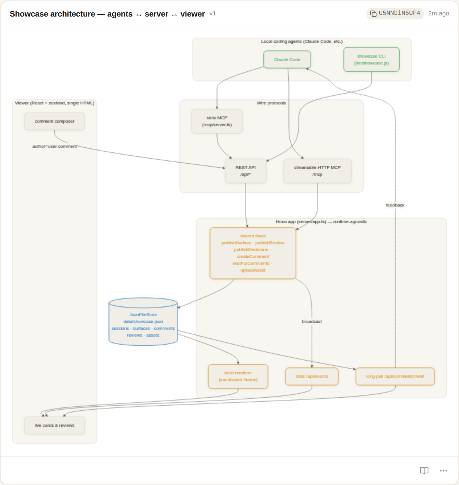

# Showcase — architecture (a living doc)

_How this app works: how a terminal coding agent (Claude Code and friends)
connects to it, how surfaces and reviews are stored, and how the publish → render
→ comment → revise loop closes. This is a living document — when the
implementation moves, move this with it._

> Companion docs: [`review-form-factor.md`](./review-form-factor.md) is the north
> star for the decision-queue review UX; [`../CLAUDE.md`](../CLAUDE.md) is the
> short agent guide and file map; [`../guide/`](../guide) holds the runtime
> instructions the server itself serves to agents (`PLAYBOOK.md`,
> `DESIGN_GUIDE.md`, `AGENT_SETUP.md`).

---

## 1. What showcase is

Showcase is a **live visual surface for terminal coding agents**. An agent that
works in your terminal can't show you anything richer than scrollback. Showcase
gives it a browser tab you keep open: the agent **publishes surfaces** (cards
made of typed parts — html, markdown, diff, mermaid, terminal, image, json,
code, chart, trace), you **watch them render live**, you **comment back** (a
remark on a card, an annotation pinned to a spot, an Approve/Dismiss on a review
finding), and the agent **reads that feedback and revises**.

That two-way loop — **publish → live render → comment → revise/reply** — is the
product. Everything below is in service of it. When a design question is
ambiguous, the tie-breaker is "what keeps the loop tight."

This repo is a personal fork of [sideshow](https://github.com/modem-dev/sideshow),
stripped to the **local-only** engine: one Node process, one JSON file, one
browser tab. (The upstream Cloudflare `SqlStore` was removed; `JsonFileStore`
is the only store here.)

---

## 2. The shape of the system



_(This diagram was itself authored as a `mermaid` surface and published through
showcase — `showcase mermaid arch.mmd` — then screenshotted from the live
viewer. Eating our own dog food: §9.)_

Three moving parts and one file:

| Part | Lives in | Role |
| --- | --- | --- |
| **Server** | `server/app.ts` (+ `server/index.ts` Node wiring) | A Hono app: REST API, SSE feed, long-poll, the `/s/:id` renderer, asset I/O, and the **shared flow functions** both REST and MCP call. |
| **Store** | `server/storage.ts` (`JsonFileStore`) | The whole board in memory, mirrored to one JSON file per mutation. |
| **Viewer** | `viewer/` → `viewer/dist/index.html` | A React + zustand single-page app, Vite-built into one self-contained HTML file the server reads at boot. |
| **Clients** | `bin/showcase.js` (CLI), `mcp/server.ts` (stdio MCP) | How agents reach the server. The HTTP MCP endpoint lives inside the server (`server/mcpHttp.ts`). |

The agent and the human meet at the server: the agent **writes** surfaces, the
human **reads** them in the viewer and **writes** comments, and the agent reads
those back.

---

## 3. How an agent connects

An agent can talk to showcase four ways. All of them ultimately hit the same REST
routes and the same shared flow functions in `app.ts` — the protocol is a thin
shell over one core.

### 3.1 stdio MCP (the default for Claude Code)

`mcp/server.ts` is a **stdio MCP server** that is a thin HTTP client over the
showcase API. The agent host (e.g. Claude Code) spawns `showcase mcp` (or
`node mcp/server.ts`) as a subprocess and speaks MCP over stdin/stdout. Each tool
call turns into a `fetch` against the running server:

```
Claude Code  ──MCP/stdio──▶  mcp/server.ts  ──HTTP──▶  http://localhost:8229/api/*
```

It reads three env vars (`mcp/server.ts:13`):

- `SHOWCASE_URL` — where the server is (default `http://localhost:8229`). Point
  this at a deployed instance to use the same tools remotely.
- `SHOWCASE_TOKEN` — bearer token, sent as `Authorization: Bearer …` when set.
- `SHOWCASE_AGENT` — the agent name stamped on sessions it creates (default
  `claude-code`).

One MCP process lives as long as one agent conversation, so it lazily creates
**one session** on first publish and reuses it for every later tool call
(`ensureSession`, `mcp/server.ts:48`). `SHOWCASE_SESSION` can pin an existing
session id.

### 3.2 streamable-HTTP MCP (in-process, works deployed)

The server **also** exposes MCP directly at `POST /mcp` via
`server/mcpHttp.ts` (registered at the bottom of `createApp`, `app.ts:2347`). No
subprocess — an MCP-over-HTTP client connects straight to the board. Same tools,
same shared flows. This is the path that survives when the board is deployed
behind a URL rather than run as a local subprocess.

### 3.3 The CLI

`bin/showcase.js` is a **zero-dependency** Node CLI (it shells out to
`server/index.ts` / `mcp/server.ts` and otherwise just `fetch`es the API). It's
how a human starts the board and how an agent can publish without MCP wiring:

```sh
showcase serve [--port N] [--open]      # start API + viewer (foreground)
showcase service install|status|...     # run it as a launchd/systemd background service
showcase mermaid arch.mmd --title …      # publish a diagram surface
showcase publish card.html --md notes.md # an html part + a markdown part, one card
showcase review <branch> [--base b]      # scaffold a code-review session from a diff
showcase finding --title … --problem …   # one structured review finding
showcase wait                            # block for the user's feedback (long-poll)
showcase image pic.png / trace t.json …  # upload + publish an asset surface
```

Run `showcase help` for the full surface (every part kind has a verb:
`markdown`, `diff`, `terminal`, `json`, `chart`, `code`, …).

### 3.4 Raw REST

Every flow is a plain HTTP endpoint, so a bare `curl` works with no ceremony — a
`POST /api/surfaces` with a `parts` array (or the html-sugar `POST
/api/snippets`) auto-creates a session if none is given. See §7 for the map.

### 3.5 Setup the agent reads at runtime

Agents are told (via a pasted block in `AGENTS.md`/`CLAUDE.md`, see
`guide/AGENT_SETUP.md`) to fetch the **current** instructions from the running
server rather than bake them into a skill:

```sh
SHOWCASE_URL=http://localhost:8229 showcase playbook   # → GET /playbook
SHOWCASE_URL=http://localhost:8229 showcase guide      # → GET /guide  (design contract)
```

So `guide/PLAYBOOK.md` and `guide/DESIGN_GUIDE.md` are served live (`app.ts:1756`)
and can improve without re-installing anything on the agent side.

---

## 4. The data model

Defined in `server/types.ts` (deliberately free of any `node:` import so it's
safe on any runtime). Five entities, all owned by a **session**.

### 4.1 Session

A session is one agent conversation / task (`types.ts:3`). It carries the agent
name, an optional title (the user can rename it in the viewer), the cwd, and
`agentSeq` — **the high-water mark of comments already delivered to the agent**.
That cursor is the backbone of exactly-once feedback delivery (§5.3).

### 4.2 Surface — an ordered list of parts

A **surface** is a card: an ordered list of **parts**, each declaring its own
`kind` (`types.ts:21`). The surface is kind-agnostic; a part is the unit of
rendering. Ten kinds:

| Kind | Rendered by | Sandboxed? | Notes |
| --- | --- | --- | --- |
| `html` | `/s/:id` in an iframe | **yes** | Arbitrary agent markup. Opt-in style/JS **kits** (`server/kits.ts`). |
| `code` | viewer (shiki) → iframe | **yes** | Highlighted source; the HTML string is built by shiki then sandboxed. |
| `markdown` | viewer (markdown-it) | no — escaped | Prose. Embedded raw HTML is escaped, not executed. |
| `mermaid` | viewer (mermaid, `securityLevel:strict`) | no — sanitized | Diagram source → SVG. |
| `diff` | viewer (`@pierre/diffs`) | no — data | Unified patch and/or before/after file pairs. |
| `image` | viewer `` | no — data | References an uploaded asset by id. |
| `trace` | viewer | no — data | A step timeline; inline steps and/or an asset file. |
| `terminal` | viewer (ansi_up) | no — data | Monospace output; ANSI SGR → styled spans, everything else escaped. |
| `json` | viewer (text nodes) | no — data | Collapsible tree; escapes by construction. |
| `chart` | viewer (Recharts) | no — data | bar/line/area/pie/treemap/scatter, themed from live tokens. |

A surface is **versioned**: every revise pushes the prior version onto `history`
(capped at `HISTORY_LIMIT = 20`, `storage.ts:300`) and bumps `version`. It can
carry a scannable **badge** (`SurfaceBadge` — a tone + a short label like
"Bug" / "Nit" / "Approve"), versioned with the content. A **snippet** is just
sugar for a surface with a single `html` part (`htmlPart`, `types.ts:466`).

### 4.3 Comment

A comment (`types.ts:311`) is the human's half of the loop. It attaches to a
**surface** (a remark on a card) or to the **session** (`surfaceId: null`, a
chat-level message). Each has a monotonic `seq` (the cursor unit), an `author`
(`"user"` is the reserved signal the agent listens for), and an optional
**anchor** (`CommentAnchor`) pinning it to a spot — either a point (`xPct`/`yPct`
on a diagram/image/chart) or a `line` in a diff/code part.

### 4.4 Review — the decision-queue form factor

A **review** (`types.ts:280`) is the agent-era PR-review structure: a plain-English
`brief`, a `verdict` (block/approve/comment), and a risk-ranked array of
**decisions** the agent triaged out of the diff for the human to adjudicate. Each
`Decision` carries a recommendation (`block`/`ship`/`decide`), a `scope` (how far
you must look — changed-line / whole-file / codebase), a confidence, and a
required **`coverage`** field — the honesty ledger of what the agent did and did
**not** check. Stored **one per session**, distinct from the card stream, and
rendered at `/?review=<sessionId>`. See `review-form-factor.md` for the full
rationale and the Accept / Override / Prove-it / Challenge interaction loop.

### 4.5 Asset

An **asset** (`types.ts:333`) is an uploaded blob (image, trace, file) stored
**apart** from surfaces so binary never bloats the parts JSON. Its id is the
**SHA-256 of its bytes** (`hashAssetId`, `types.ts:456`) — content-addressed, so:

- identical uploads dedupe to one stored blob;
- an agent can **derive the `/a/:id` URL from the bytes alone** and reference it
  in a surface *before* the upload lands (the `/a/:id` route briefly waits for a
  referenced-but-not-yet-present asset, `app.ts:2264`).

The board keeps assets under a budget (`MAX_BOARD_ASSET_BYTES = 2 GiB`) with a
**reference-aware LRU eviction**: oldest-accessed first, but a blob a live surface
still points at is only evicted as a last resort (`selectEvictions`,
`types.ts:537`). Per-asset cap is `MAX_ASSET_BYTES = 5 MiB`.

---

## 5. The interaction loop in detail

This is the heart of the system. Trace one full round trip.

### 5.1 Publish (agent → board → viewer)

The agent calls `publish_surface` / `publish_finding` / `publish_review` /
`publish_decisions` (MCP), or `POST /api/surfaces` / `/api/findings` /
`/api/reviews` (REST), or a `showcase` CLI verb. All land on a **shared flow**
function in `app.ts` — `publishSurface`, `publishFinding`, `publishReview`,
`publishDecisions` — so validation and side effects happen in exactly one place,
regardless of transport.

`publishSurface` (`app.ts:1175`): validates the parts (`validateSurfaceParts`),
enforces the 2 MiB surface cap, resolves or **auto-creates** the session, writes
the surface to the store, and **broadcasts** a `surface-created` event on the
in-process `EventBus` (`server/events.ts`).

### 5.2 Live render (board → viewer)

The viewer holds an SSE connection to `GET /api/events` (`app.ts:2284`), optionally
filtered to one session. When a `surface-created` / `surface-updated` /
`review-updated` / `comment-created` / `agent-presence` event is broadcast, the
viewer re-fetches and re-renders — the card appears or updates live, no reload.
`html` and `code` parts render inside sandboxed iframes pointed at `/s/:id?part=N`
(§6); the data-shaped parts render natively in the trusted viewer.

### 5.3 Comment + feedback delivery (human → board → agent)

The human types a comment in the viewer → `POST /api/comments` with
`author: "user"`. Now the agent needs to hear it. Two delivery paths, one cursor:

1. **Long-poll / blocking wait.** `wait_for_feedback` (MCP) or `showcase wait` or
   `GET /api/comments?session=…&author=user&wait=N` parks the request open until a
   matching comment lands or `N` seconds elapse (`waitForComments`, `app.ts:1522`;
   `MAX_WAIT_SECONDS = 300`). A parked `author=user` wait **is** the signal that
   "an agent is listening" — it increments a per-session waiter count and
   broadcasts `agent-presence`, which the viewer shows live.

2. **Piggyback.** The agent doesn't have to block. Any time it writes (publishes,
   revises, or replies), `collectFeedback` (`app.ts:1165`) attaches comments the
   agent hasn't seen yet to the write's response. So feedback rides along on the
   next publish for free.

Both paths share the session's **`agentSeq` cursor**. Reads resume from
`agentSeq` and advance it past everything in the window (including the agent's own
comments), so a comment is delivered to the agent **exactly once** whether it
arrives via long-poll or piggyback. The cursor lives server-side, so the CLI,
both MCP transports, and piggyback all share one stream.

**Feedback batching.** A naive wait wakes on the *first* comment, missing a second
message the user is still typing. Instead, once the first comment lands the wait
stays open through a short quiet window (`FEEDBACK_SETTLE_MS = 800ms`) — extended
while the viewer sends "composing" heartbeats to `POST /api/composing`
(`FEEDBACK_COMPOSING_TTL_MS = 3s`), bounded by `FEEDBACK_MAX_BATCH_MS = 25s`. So a
burst of queued messages comes back together (`app.ts:1551`).

### 5.4 Revise (agent → board → viewer)

The agent revises **in place** (`update_surface` / `PUT /api/surfaces/:id` →
`reviseSurface`, `app.ts:1428`): the prior version is archived to `history`, the
new parts replace it, `version` bumps, and a `surface-updated` event re-renders
the open card. Republishing a review (`publishDecisions`) broadcasts
`review-updated` so an open review page updates the decision in place — the live
half of the Prove-it / Challenge loop.

---

## 6. Rendering & the security model

**The load-bearing invariant** (also in `CLAUDE.md`): agent-authored content that
becomes HTML **must** render inside a sandboxed, opaque-origin iframe — never as
`innerHTML` in the trusted viewer origin. The viewer shares an origin with the
authenticated API and the comment→agent channel, so a script running there could
forge the reserved `author:"user"` feedback signal or exfiltrate the token.

Two safe paths, no third:

1. **Build a string, hand it to a sandbox.** `html` parts render at `GET /s/:id`
   via `renderHtmlPage` (`server/surfacePage.ts`) — a themed, sandboxed document
   the viewer embeds per part. `code` parts are highlighted to an HTML string by
   shiki, then rendered through the same sandbox (`SandboxedPart`).
2. **Keep it as data, render with React text nodes / attributes.** `image`,
   `trace`, `json`, `chart`, `terminal`, `diff` are structured data the viewer
   renders with escaping-by-construction. `markdown` and `mermaid` render in the
   viewer's origin but are escaped / sanitized (markdown-it escapes embedded HTML;
   mermaid runs `securityLevel: 'strict'`).

Supporting controls: a **CSRF guard** blocks cross-origin state-changing requests
to `/api` and `/mcp` (`app.ts:1624`) — the token-less local default would
otherwise let any open web page POST forged feedback to localhost. **Asset
serving** only sends raster images `inline`; svg/json/text/everything-else go out
as `attachment` with `X-Content-Type-Options: nosniff`, so a top-level open of
`/a/:id` can never execute an uploaded document as a same-origin script
(`assetServeHeaders`, `app.ts:85`). Surface **ids are 64-bit unguessable
capabilities** (`newId`, `types.ts:445`) — in `publicRead` mode the id is the
share secret.

Theming (`server/themes.ts`) and html **kits** (`server/kits.ts`, opt-in CSS/JS
bundles like `issues` / `slides` / `review`) are injected into the sandbox doc,
never into the trusted origin.

---

## 7. API & tool surface (reference)

All three surfaces are the same core; pick by how the agent is wired.

### REST (`server/app.ts`)

| Method · path | Purpose |
| --- | --- |
| `GET /` · `/session/:id` · `/session/:id/s/:sid` | The viewer SPA (config injected per request). |
| `GET /s/:id?part=N&theme=&mode=` | Render one html part as a sandboxed document. |
| `POST /api/surfaces` · `/api/snippets` | Publish a surface (snippets = single html part). |
| `GET·PUT·DELETE /api/surfaces/:id` | Read / revise (versioned) / delete a surface. |
| `POST /api/findings` | Publish one composed review finding card. |
| `POST /api/reviews` | Publish a whole review: verdict card + one card per finding. |
| `GET·POST /api/sessions/:id/review` | The decision-queue review for a session. |
| `GET·POST /api/sessions` · `PATCH·DELETE /api/sessions/:id` | List / create / rename / delete sessions. |
| `GET /api/sessions/:id/surfaces` · `/export` | Session cards; static self-contained HTML export. |
| `POST /api/comments` · `GET /api/comments?…&wait=N` | Post a comment; long-poll for feedback. |
| `POST /api/composing` | "User is composing" heartbeat (extends the batch window). |
| `POST /api/assets` · `GET /a/:id` | Upload a blob (raw or base64 envelope); serve it. |
| `GET /api/events?session=` | SSE live feed. |
| `GET /guide` · `/playbook` · `/setup` · `/api/kits` · `/api/version` | Runtime docs & metadata. |
| `POST /mcp` | Streamable-HTTP MCP (§3.2). |

### MCP tools (`mcp/server.ts` stdio + `server/mcpHttp.ts` http)

`publish_surface`, `publish_snippet`, `publish_review`, `publish_decisions`,
`review_finding`, `update_surface`, `update_snippet`, `delete_surface`,
`wait_for_feedback`, `list_surfaces`, `upload_asset`, `comment` (http),
`get_design_guide`. Descriptions and input schemas are centralized in
`server/mcpSpec.ts` so both transports stay in sync.

---

## 8. Storage internals (`JsonFileStore`)

The entire board lives in memory as `Map`s (sessions, surfaces, assets, reviews)
plus a comments array (`storage.ts:100`). Every mutation calls `persist()`, which
serializes the whole board to JSON and writes it through a **serialized write
queue** with the atomic `write-tmp + rename` pattern (`storage.ts:155`) so a crash
mid-write never corrupts the file. Default path is `data/showcase.json`, override
with `SHOWCASE_DATA`.

Consequences worth knowing:

- **In-memory budget = disk budget.** Because the whole board is rewritten per
  mutation, the asset budget bounds resident size, not just disk.
- **Reads return clones** (`structuredClone`) so callers can't mutate store state.
- **Content-addressed assets** dedupe and survive across sessions; deleting a
  session only drops its *own* assets that no surviving surface references
  (`storage.ts:220`).
- **Legacy migration on load:** pre-0.5.0 boards stored `snippets` (a single
  `html` field) and `snippetId` comments; `loadFromDisk` lifts those into the
  parts model transparently (`liftSnippet` / `liftComment`, `storage.ts:67`).
- **`Store` is an interface** (`types.ts:391`) with a store-contract test, kept
  honest so a second implementation could slot in — even though this fork ships
  only `JsonFileStore`.

---

## 9. Code reviews & "pull requests"

Showcase does **not** integrate with GitHub PRs or store PR objects. What it stores
is the **review of a branch/diff** — its answer to "how do you review agent-written
code." Two layers:

- **The card stream** — `showcase review <branch>` scaffolds a session (seeded with
  a churn manifest, a risk band, and a ready-to-paste prompt that delegates the
  analysis to your `code-review` skill). The skill then publishes a **verdict card**
  plus one **finding card** per issue (`publish_review` / `review_finding`). Each
  finding is *composed* by the server from fields (severity badge, problem, inline
  suggestion diff, optional mermaid, blast-radius graph) — the structure is the API,
  so a review physically can't regress into one wall of prose (`buildFinding`,
  `app.ts:386`).
- **The decision queue** — the north-star form factor (`publish_decisions` →
  `/?review=<session>`): a brief + a risk-ranked queue of decisions, each with a
  required coverage ledger, that the human adjudicates with Accept / Override /
  Prove-it / Challenge. See [`review-form-factor.md`](./review-form-factor.md).

A finished review can be shared as a **static, self-contained HTML export**
(`GET /api/sessions/:id/export`) that renders with no server — the share artifact,
not a GitHub round-trip.

---

## 10. Generating images with showcase (how the §2 diagram was made)

The diagram at the top is not hand-drawn — it was produced **by showcase**, which
is the most direct demonstration of the loop. The recipe, reusable for any doc
asset:

```sh
# 1. start the board (build the viewer first if needed)
npm run build:viewer
SHOWCASE_DATA=/tmp/scratch.json node server/index.ts &     # → http://localhost:8229

# 2. publish a mermaid surface through the real API
SHOWCASE_URL=http://localhost:8229 \
  node bin/showcase.js mermaid arch.mmd \
  --title "Showcase architecture" --session-title "Architecture doc"
# → prints { id, sessionId, url }

# 3. screenshot the live-rendered card to docs/images/
#    (headless Chromium → the viewer renders mermaid to SVG → element screenshot)
node screenshot.mjs   # playwright: goto(url), wait for '.card' svg, card.screenshot()
```

Because `mermaid` parts render in the trusted viewer (not at `/s/:id`, which only
serves html parts), the screenshot targets the `.card` element in the full viewer.
The resulting PNG carries the real card chrome — title, the copyable card id, the
board theme — because it *is* a real card.

---

## 11. Runtime & build constraints (don't trip on these)

- **Type-stripping, no build step (server/CLI).** Server and CLI TypeScript run
  directly on **Node ≥ 22.18** via type stripping, so only *erasable* syntax is
  allowed: no enums, no parameter properties, `.ts` extensions in relative imports.
  The **viewer is the exception** — it's Vite-built into one HTML file.
- **Runtime-agnostic core.** `server/{app,events,mcpHttp,surfacePage,types}.ts`
  must not import `node:` anything (they use Web platform globals like `crypto`).
  Node wiring is confined to `server/index.ts` and `server/storage.ts`.
- **The viewer is read at boot.** `server/index.ts` reads
  `viewer/dist/index.html` once at startup, so viewer changes need a rebuild +
  restart. **`npm run dev`** does the whole dance (build, watch both halves,
  auto-restart, clean shutdown). `npm run build:viewer` + restart is the manual
  path.
- **Port 8229.** (Sideshow's 8228, shifted to avoid collision.)
- **Env vars are `SHOWCASE_`-prefixed:** `SHOWCASE_URL`, `SHOWCASE_TOKEN`,
  `SHOWCASE_DATA`, `SHOWCASE_AGENT`, `SHOWCASE_SESSION`, `SHOWCASE_PUBLIC_READ`,
  `SHOWCASE_DEV`, `PORT`.
- **Validation gates:** `npm test` (node --test: unit/API + store contract),
  `npm run typecheck` (node + viewer tsc programs), `npm run lint` (oxlint,
  warnings are errors), `npm run format:check` (oxfmt).

---

## 12. Where to look next

| You want to understand… | Start at |
| --- | --- |
| Every route and the shared flows | `server/app.ts` |
| The data model & the `Store` interface | `server/types.ts` |
| On-disk persistence, eviction, migration | `server/storage.ts` |
| Sandboxed html rendering | `server/surfacePage.ts`, `server/themes.ts`, `server/kits.ts` |
| MCP tool schemas (one source of truth) | `server/mcpSpec.ts` |
| The stdio MCP client | `mcp/server.ts` |
| The CLI | `bin/showcase.js` |
| The viewer | `viewer/` (zustand store, parts components, shadcn/ui) |
| The review UX north star | `docs/review-form-factor.md` |
| Agent-facing runtime instructions | `guide/PLAYBOOK.md`, `guide/DESIGN_GUIDE.md` |

_Keep this current: if you add a part kind, a transport, a route, or change the
feedback cursor, update the relevant section here in the same change._
