# Preset gallery

Generated by `scripts/preset-shots.ts`. Each built-in preset, rendered light + dark.

## Product demo

Branded walkthrough — fixed five-beat arc, product palette

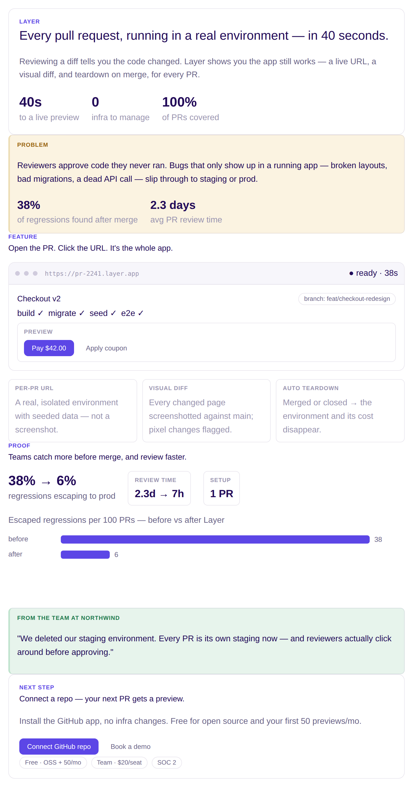
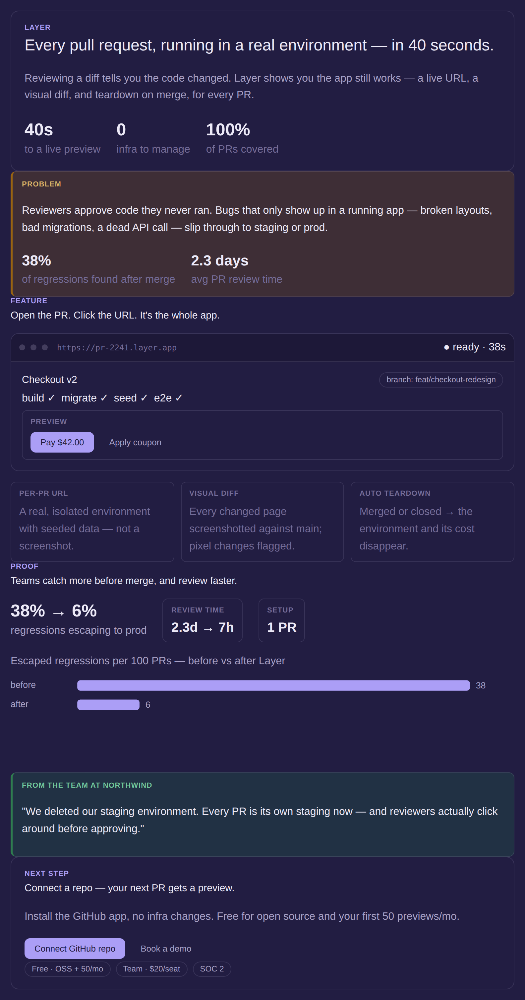

## Concept explainer

Teach an idea — neutral palette, charts welcome, free structure

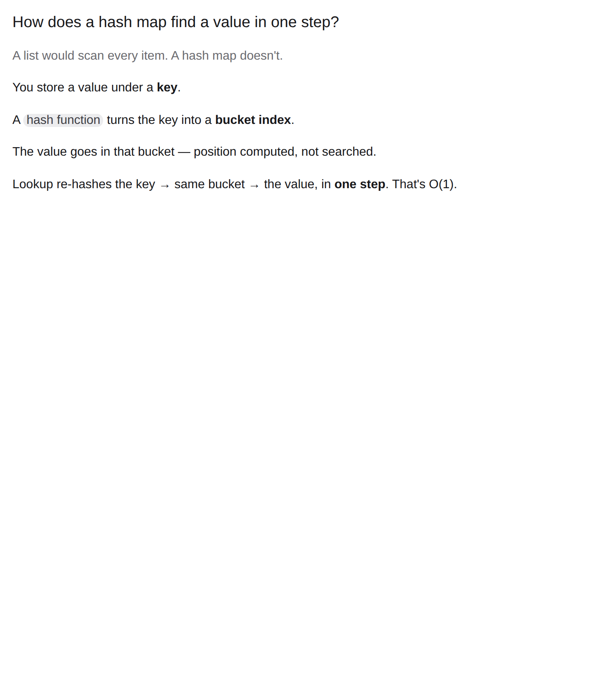
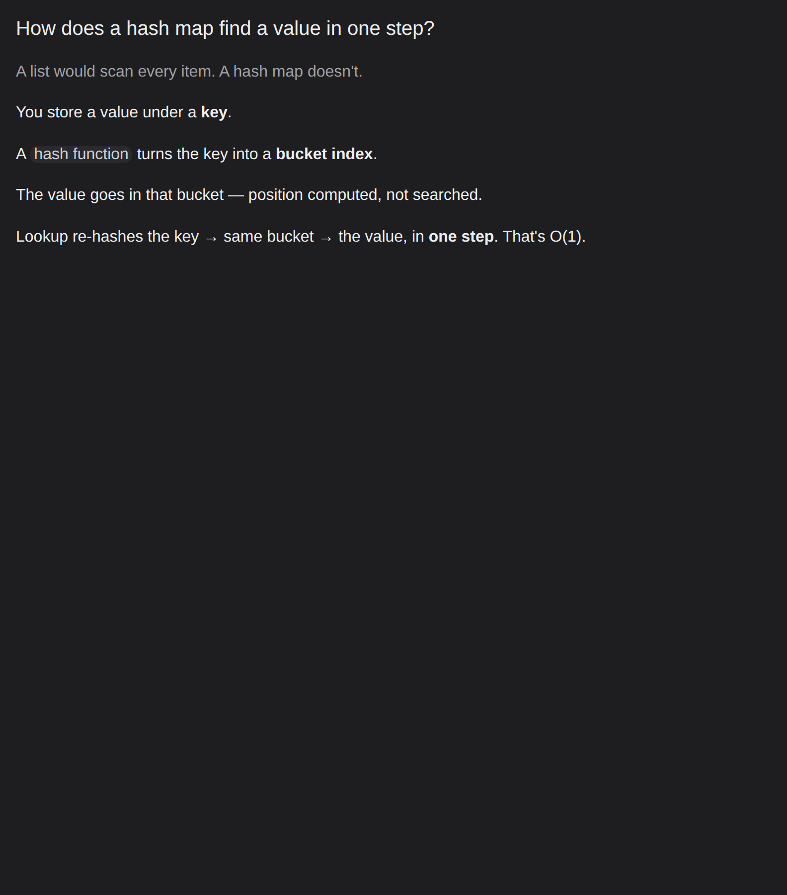

## Design doc

Technical design / RFC — the detailed design-doc template (goal-as-problem, axes, trade-offs)

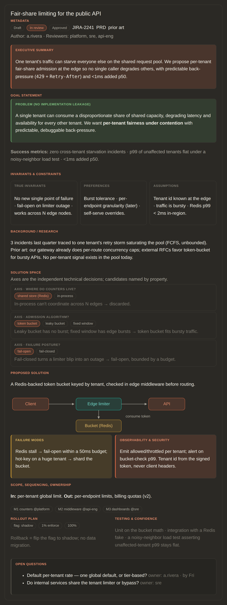

## Product mockup

Visualize a product idea fast — mocked screens, the core flow, key states, what to test

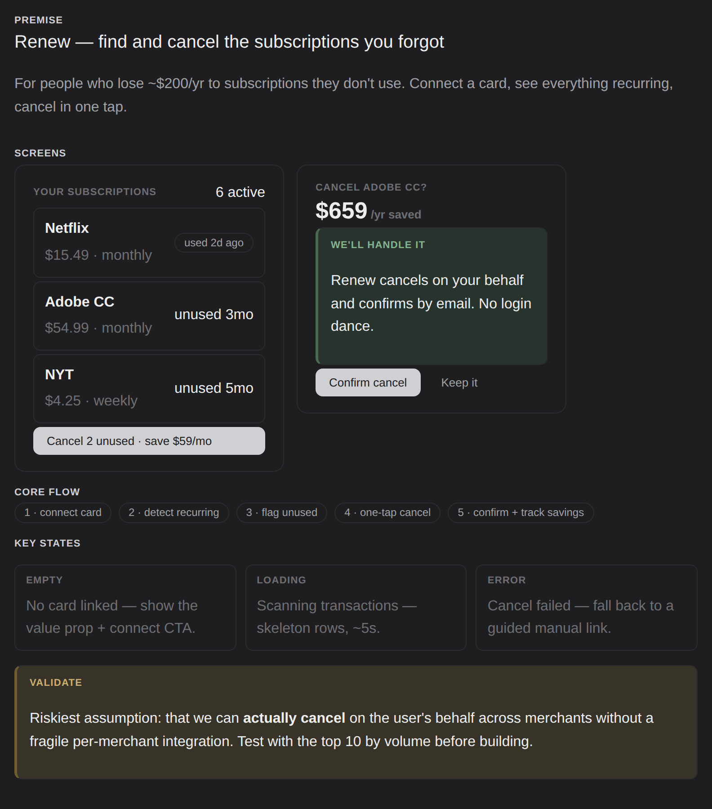

## Architecture

System design — diagram-led overview, components, data flow, decisions, scale

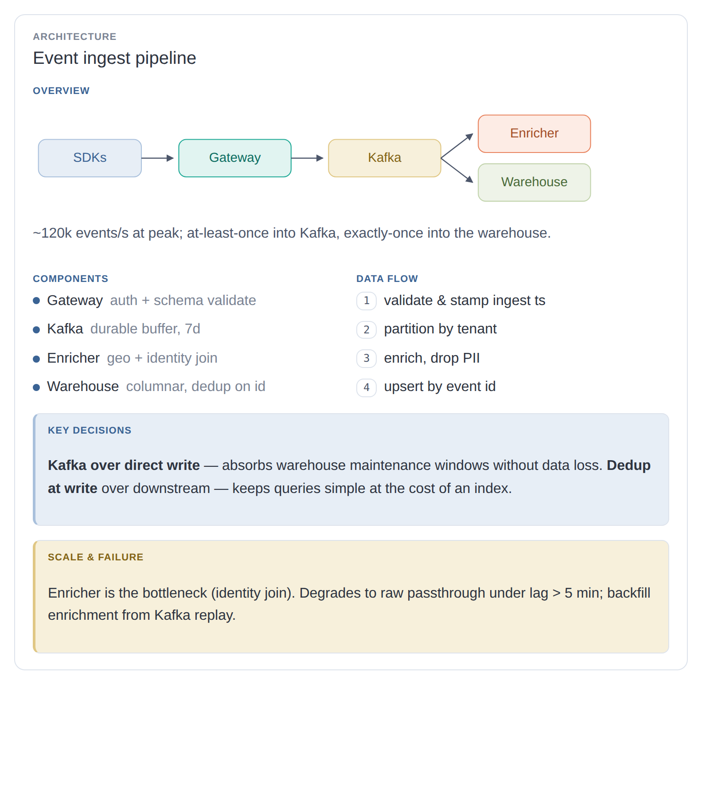
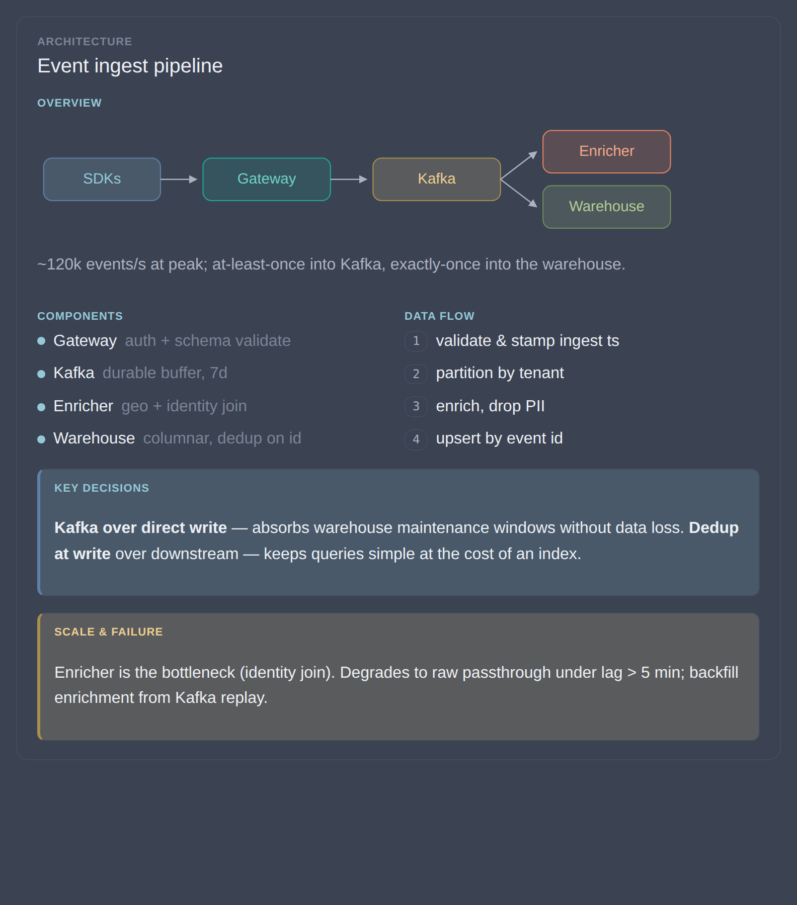

## Data viz

Metrics dashboard — headline stat, main chart, trend, detail, takeaway

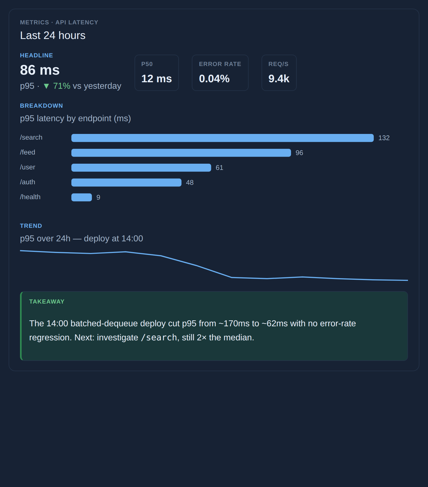

## Postmortem

Blameless incident review — impact, timeline, 5 Whys to a systemic cause, tiered fixes, owned follow-ups

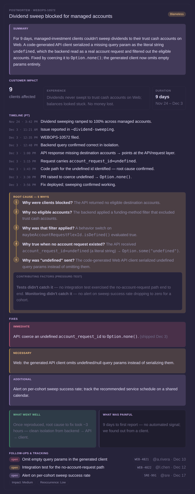

## Status report

Recurring update — headline, shipped, in flight, blockers, next up

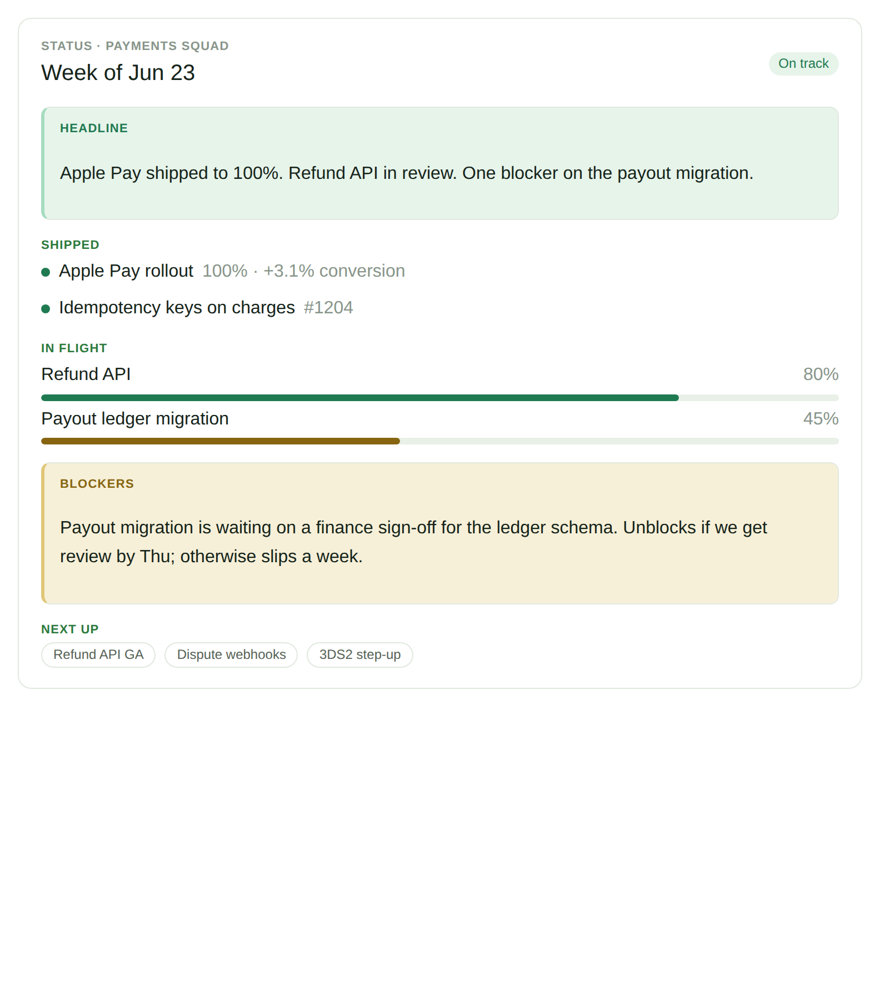
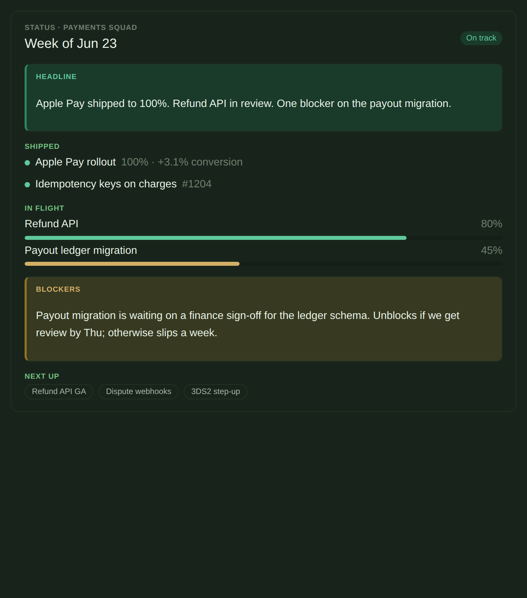
